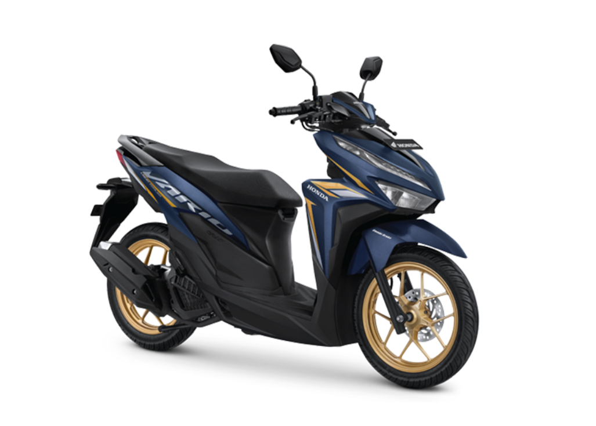
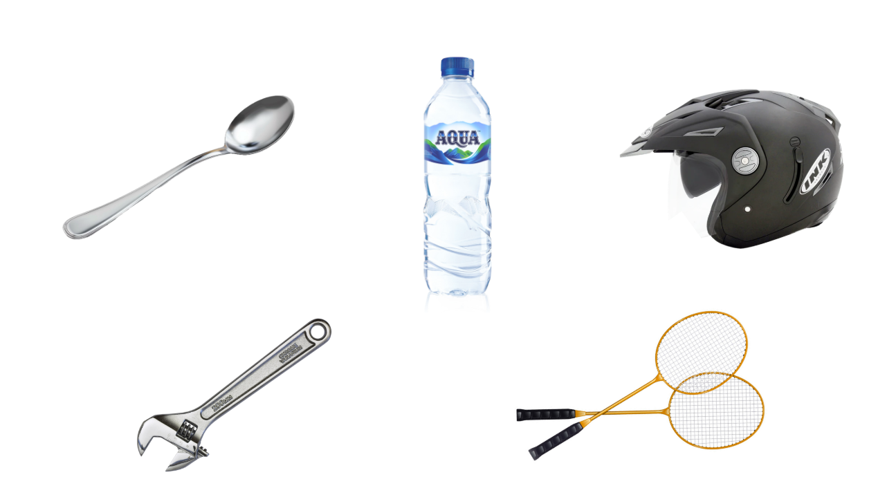
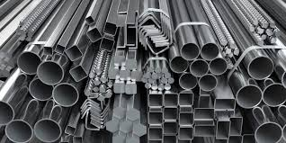
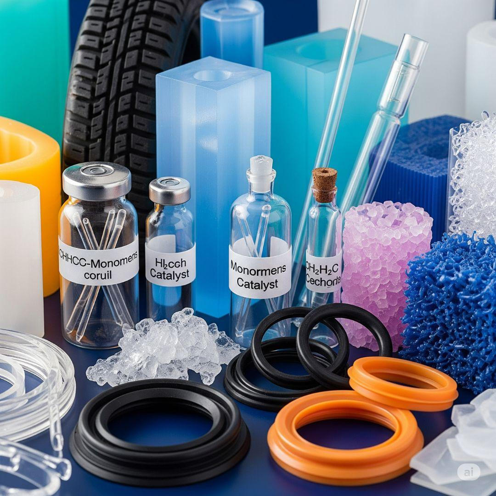
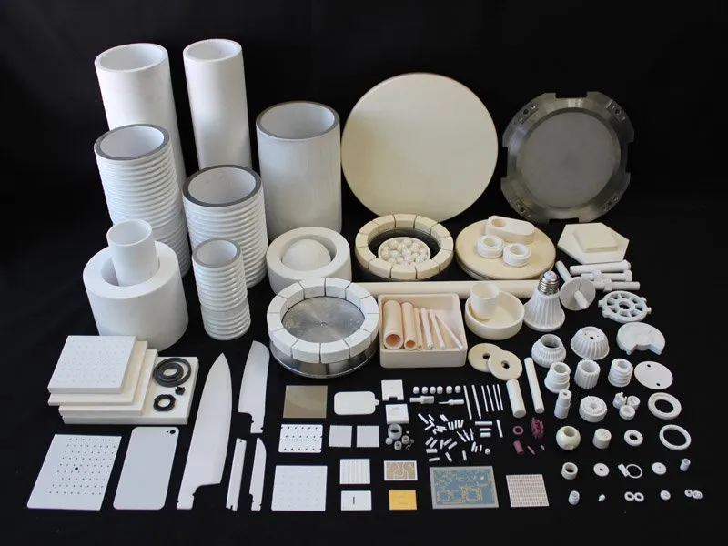
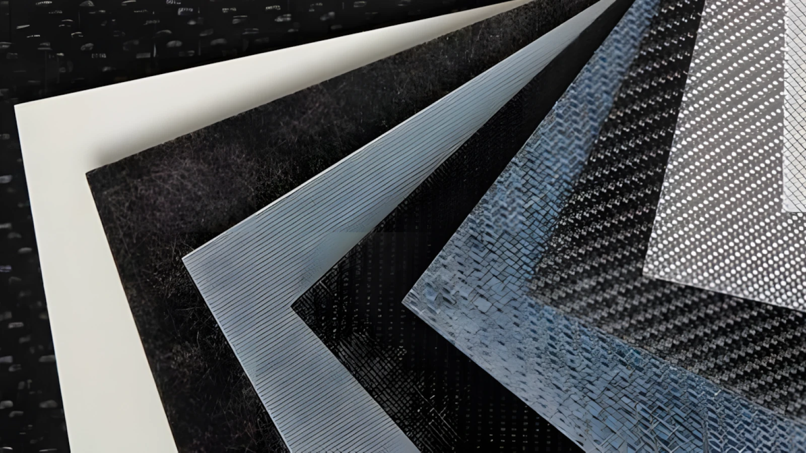
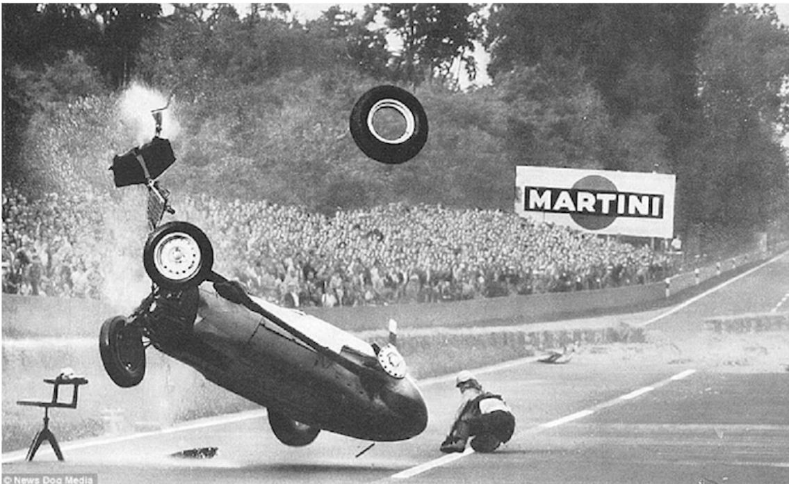
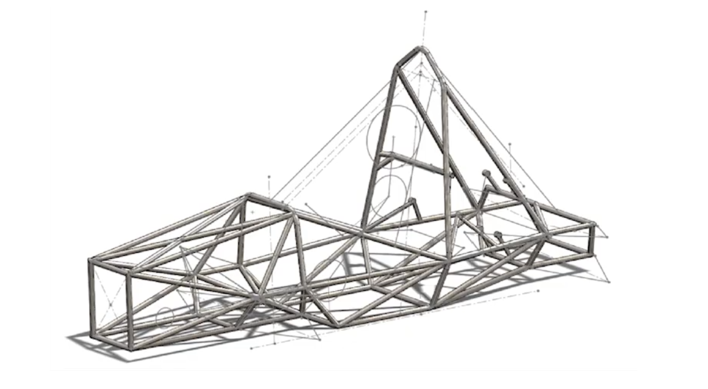
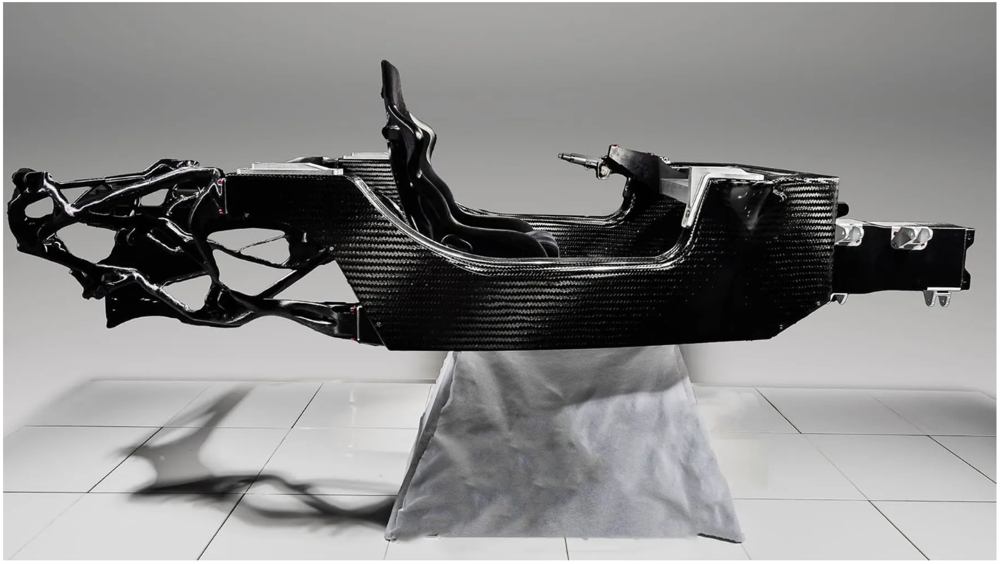

# Bab 1: Jenis dan Sifat Mekanik Material

**Material Teknik TRM 1003**  
**Fajrul Falah, S.Si, M.Sc**

----
## 1. Pendahuluan: Filosofi Pemilihan Material

Dalam dunia teknik, pemahaman terhadap material-material yang digunakan sangat penting, karena setiap material memiliki sifat dan karakteristik tertentu.

Sebagai contoh, mari kita lihat sebuah objek yang sangat umum: Sepeda Motor. Jika kita membedah satu unit motor, kita akan menemukan berbagai jenis material yang bekerja bersamaan. Rangka terbuat dari logam, body motor dari plastik, ban dari karet, hingga busi yang mengandung keramik.

Fenomena ini mengajarkan prinsip dasar paling penting bagi seorang engineer: 

> *Tidak ada satu pun material yang sempurna untuk semua hal*. 

Kita tidak bisa membuat seluruh motor dari baja karena akan terlalu berat, dan kita tidak bisa membuatnya seluruhnya dari plastik karena akan meleleh atau patah saat menahan beban mesin.

Setiap komponen membutuhkan material yang berbeda sesuai dengan:
- Fungsinya.
- Kondisi kerjanya (panas, beban, gesekan).
- Sifat yang diperlukan.

Oleh karena itu, tugas seorang engineer adalah bijak dalam memilih material. Keputusan ini bukan hanya soal "mana yang paling kuat", melainkan "mana yang paling tepat" untuk aplikasi tersebut.

Sebelum masuk ke teori mendalam, mari kita uji intuisi teknik kita terhadap benda sehari-hari:

- Sendok: Mengapa umumnya logam (stainless)? _Karena perlu keras, higienis, dan tidak mudah patah._
- Botol Air Mineral: Mengapa polimer (plastik)? _Karena ringan, transparan, dan murah._
- Ragum: Mengapa logam? _Karena butuh kekakuan tinggi untuk menjepit._
- Helm: Mengapa fiber glass? _Kombinasi polimer (cangkang luar) dan foam, dirancang untuk menyerap benturan ringan namun keras di luar._
- Raket: Mengapa komposit (karbon)? _Butuh sangat ringan agar tangan tidak pegal, tapi harus sangat kaku untuk memukul bola._

## 2. Kategori Umum Material

Secara garis besar, material teknik dikelompokkan menjadi empat kategori utama: Logam, Polimer, Keramik, dan Komposit.

### A. Logam (Metals)

Logam adalah material yang umumnya keras, kuat, dapat menghantarkan panas dan listrik, serta dapat ditempa atau dibentuk tanpa mudah patah. Ketika kita berbicara tentang struktur yang perlu menahan beban berat, logam biasanya menjadi pilihan utama.

**Karakteristik Utama:** 
- Logam memiliki kombinasi kekuatan dan keuletan (duktilitas). _Artinya, logam itu kuat, tetapi jika dibebani berlebih, ia cenderung bengkok dulu sebelum patah._ 
- Dapat dibentuk (ditempa, dipotong, dilas, dll)
- Logam juga merupakan konduktor yang baik untuk listrik dan panas
- Memiliki permukaan yang berkilau

**Intinya:** Logam dipakai untuk bagian yang krusial menahan beban dan membutuhkan kekuatan struktural.

**Contoh:** Besi, baja (steel), aluminium, nikel, titanium, chrome, dan stainless steel.

### B. Polimer (Polymers)

Polimer adalah material yang tersusun dari rantai molekul panjang (monomer) yang membentuk struktur seperti “tali panjang”. Kebanyakan berasal dari minyak bumi, tapi ada juga dari bahan alami.

**Karakteristik Utama**: 
- Ringan
- Mudah dibentuk
- Tidak korosi
- Umumnya isolator (menghambat listrik dan panas)

**Intinya**: Polimer dipilih saat kita membutuhkan material yang ringan, murah, anti-karat, dan mudah diproduksi massal.

**Contoh**: Plastik (botol), PVC (pipa), ABS (casing elektronik), Karet (ban), dan Nylon.

### C. Keramik (Ceramics)

Keramik adalah material anorganik non-logam yang terbentuk dari senyawa logam dan non-logam. Proses pembuatannya melibatkan pembakaran pada suhu yang sangat tinggi.

**Karakteristik Utama**: 
- Sangat keras
- Rapuh/mudah pecah
- Isolator panas/listrik
- Dibuat dengan dipanaskan

**Intinya**: Keramik dipilih untuk aplikasi yang membutuhkan ketahanan panas ekstrem, ketahanan aus (gesekan), dan kekerasan tinggi.

**Contoh**: Porselen, keramik lantai, kaca, dan Silicon Carbide (batu gerinda).

### D. Komposit (Composites)

Komposit adalah material gabungan dari dua atau lebih material yang berbeda untuk mendapatkan kombinasi sifat terbaik. Biasanya terdiri dari matriks dan penguat (reinforcement).

**Karakteristik Utama**: 
- Ringan tapi kuat
- Sifat dapat dirancang sesuai kebutuhan
- Bisa lebih baik dari material penyusunnya

**Intinya**: Komposit adalah solusi ketika kita membutuhkan sifat kombinasi dari material (misalnya butuh ringan namun kuat).

**Contoh:**
Carbon Fiber (Serat karbon + resin).
Fiberglass (Serat kaca + resin).
Beton Bangunan (Semen + tulangan baja).

## 3. Studi Kasus: Revolusi Material dan Keselamatan di Formula 1

Untuk memahami dampak nyata ilmu material, kita bisa melihat sejarah sasis (kerangka) mobil Formula 1 yang berubah drastis demi keselamatan.

Sebelum tahun 1980-an, sangat banyak kasus driver F1 meninggal dunia ketika mobil yang mereka kemudi mengalami kecelakaan. Pada masa itu, sasis F1 dibuat dari lembaran aluminium yang ditekuk atau menggunakan bahan baja. Masalahnya, meskipun aluminium ringan dan ulet, ia meneruskan energi tabrakan ke bagian pengemudi. Pada kecepatan ekstrem, logam sering kali tidak cukup kuat menahan energi tabrakan, menyebabkan kokpit "melipat" dan menjepit pembalap, yang berujung pada cedera fatal pada kejadian tabrakan.

Revolusi keselamatan mobil F1 dimulai ketika John Barnard merancang McLaren MP4/1, mobil F1 pertama dengan sasis monocoque berbahan komposit Carbon Fiber. Bahan carbon fiber ini memiliki sifat yang ringan, kuat, dan ketika tabrakan dapat lebih mudah rusak. Kondisi yang lebih mudah rusak ini, ternyata membuat energi dari tabrakan dapat terserap, sehingga energi tersebut tidak diteruskan ke area pengemudi.

Salah satu bukti keunggulan bahan carbon fiber ini terjadi pada kecelakaan Romain Grosjean di Bahrain 2020. Mobil menabrak pagar pembatas dengan kecepatan 192 km/h dan gaya deselerasi 67G. Mobil terbelah dua dan terbakar hebat. Namun demikian, sistem carbon fiber yang digunakan ternyata menyelamatkan nyawanya dari kecelakaan tersebut. 

