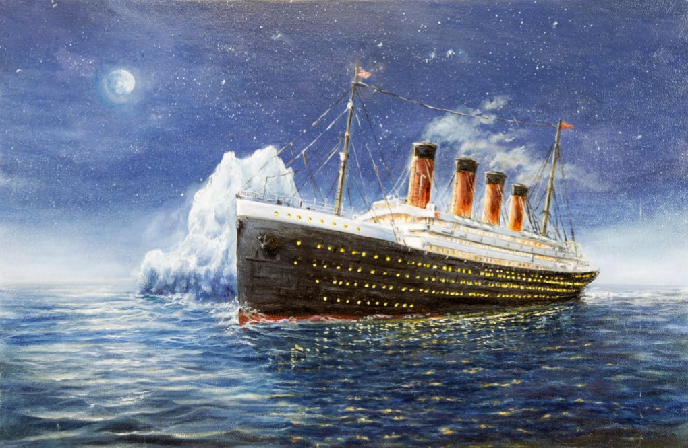
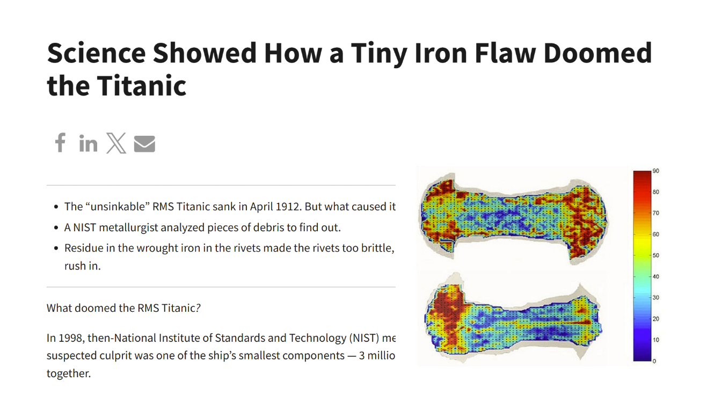
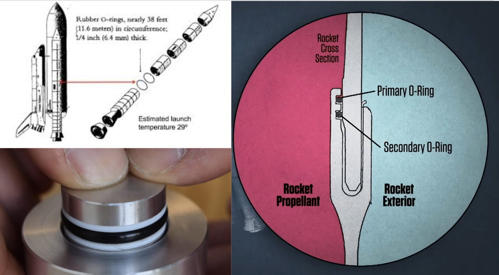
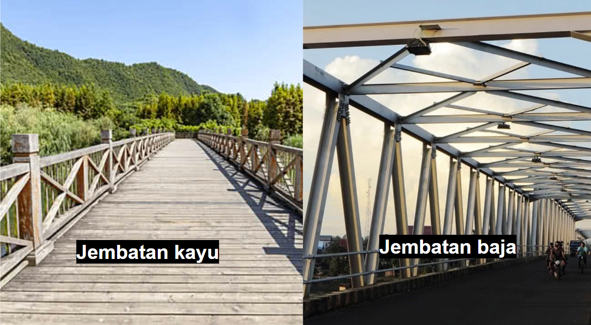
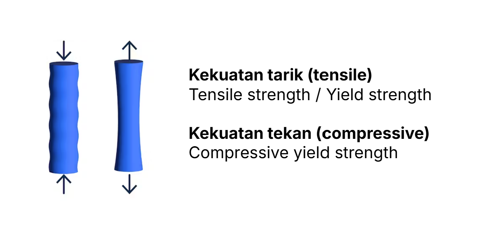
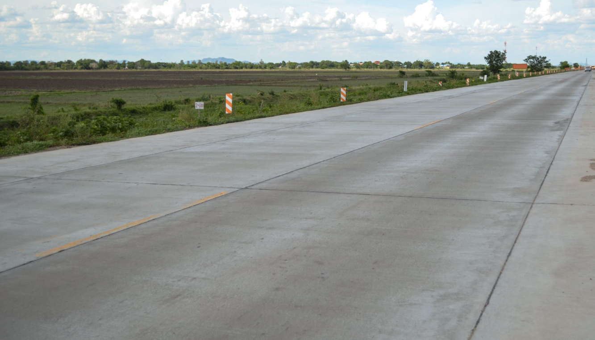
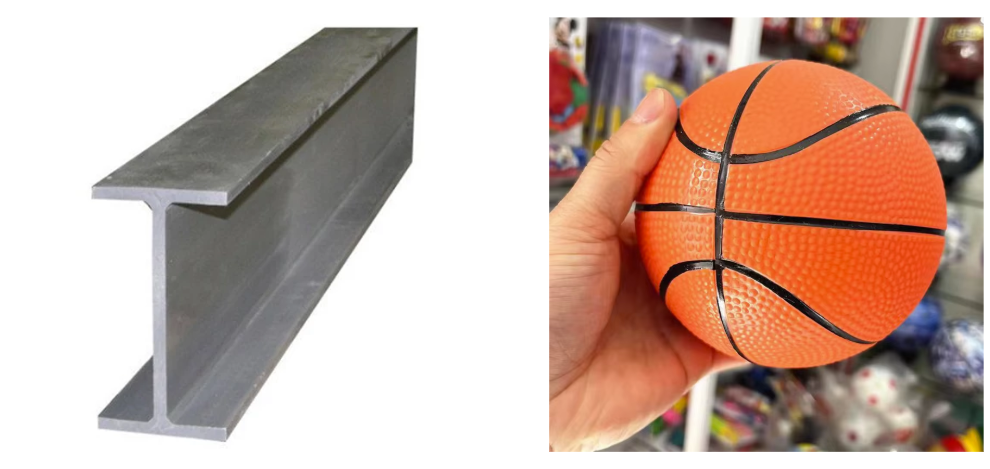
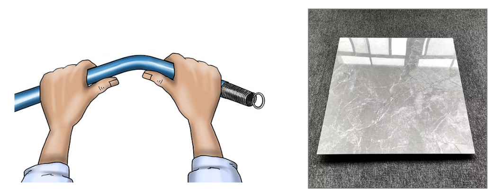
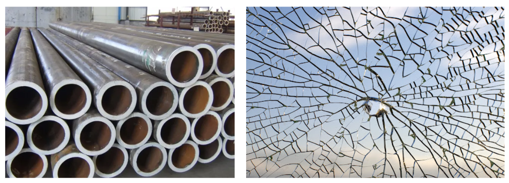
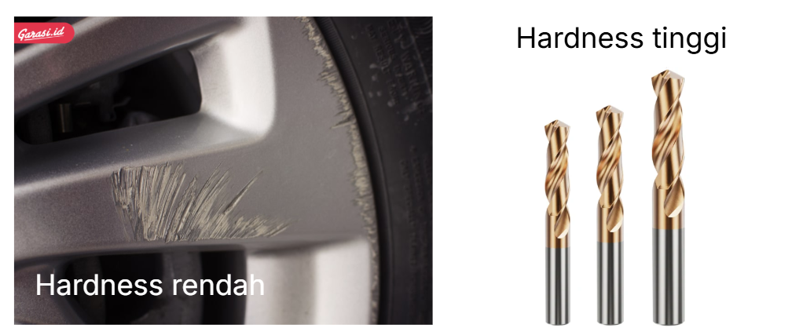

# Bab 2: Sifat Mekanik Material

## 1. Studi Kasus: Kegagalan Sifat Material

### A. Tenggelamnya Titanic (1912) - Paku Keling yang Rapuh

Pada tanggal 15 April 1912, kapal legendaris RMS Titanic, yang dijuluki sebagai kapal yang tidak mungkin karam, mengalami tragedi tabrakan dengan gunung es. Kondisi ini menyebabkan lambung kapal rusak dan kapal pun tenggelam.

Kebanyakan orang hanya akan berhenti pada informasi tersebut. Padhal, dengan mempertimbangkan kondisi normal, harusnya kapal Titanic tidak serapuh itu untuk langsung rusak parah ketika menabrak gunung es. 

Hingga akhirnya, investigasi metalurgi modern oleh National Institute of Standards and Technology (NIST) membuka fakta baru mengenai mengapa kapal Titanic ini bisa tenggelam begitu cepat.  

Ternyata, investigasi tersebut menunjukkan bahwa paku keling (rivet) besi yang menyambung pelat-pelat lambung kapal ternyata bermasalah. Besi pada paku keling tersebut ternyata mengandung kotoran (slag) dalam jumlah yang tinggi. Pada suhu ruangan yang hangat, besi ini bersifat kuat dan cukup ulet. Namun, saat kapal berlayar di perairan Atlantik Utara dengan suhu air membeku (-2°C), besi tersebut mengalami fenomena transisi ulet-ke-getas (ductile-to-brittle transition).

Akibatnya, ketika lambung kapal menabrak gunung es, paku keling tersebut tidak mengalami deformasi atau "melar" untuk menyerap energi benturan. Alih-alih bertahan, kepala paku keling tersebut langsung putus (patah getas) layaknya kaca yang dipukul palu. Hal ini menyebabkan sambungan pelat baja terbuka lebar sepanjang lambung kapal, memungkinkan air masuk dengan debit yang tak terkendali.

### B. Tragedi Space Shuttle Challenger (1986) - Karet yang Membeku

  <iframe src="https://www.youtube.com/embed/yibNEcn-4yQ"
          style="position: absolute; top:0; left: 0; width: 100%; height: 100%;"
          frameborder="0"
          allow="accelerometer; autoplay; clipboard-write; encrypted-media; gyroscope; picture-in-picture"
          allowfullscreen
          title="YouTube video player"></iframe>

Contoh lain perubahan sifat material yang fatal terjadi pada kasus meledaknya pesawat ulang-alik Challenger pada Januari 1986. Kegagalan ini berpusat pada satu komponen sederhana pada roket, yaitu: cincin segel karet atau O-ring.

Peluncuran pesawat ulang alik ini dilakukan pada pagi hari yang sangat dingin, di mana suhu turun drastis di bawah standar operasional. Karet O-ring, yang seharusnya bersifat elastis dan fleksibel untuk menutup celah sambungan gas, berubah sifat menjadi keras dan kaku karena suhu dingin tersebut.

Ketika roket dinyalakan, O-ring yang sudah kaku ini tidak bisa mengembang dengan cepat untuk menyegel celah (seal) pada sambungan roket. Akibatnya, gas panas bertekanan tinggi bocor keluar melalui celah tersebut, membakar tangki bahan bakar utama, dan memicu ledakan dahsyat hanya 73 detik setelah peluncuran. Ini mengajarkan kita bahwa sifat material tidaklah statis, mereka sangat bergantung pada suhu operasi.

> Kedua contoh di atas menunjukkan bagaimana pentingnya untuk memahami sifat mekanik dari suatu material, untuk menghindari kecelakaan besar yang dapat terjadi.

## 2. Sifat Mekanik Utama Material

Di antara banyak sifat-sifat mekanik material, terdapat 5 parameter utama yang paling penting untuk mengetahui sifat material, yaitu kekuatan (strength), kekakuan (stiffness), keuletan (ductility), ketangguhan (toughness), dan kekerasan (hardness).

### A. Kekuatan (Strength)

Secara sederhana, kekuatan adalah kemampuan material untuk menahan beban tanpa mengalami kegagalan atau patah. 

Bayangkan perbandingan antara jembatan kayu dan jembatan baja, mana yang lebih kuat? Jelas saja, jembatan baja lebih kuat daripada jembatan kayu. Baja dipilih untuk bentang yang panjang dan beban berat karena memiliki kekuatan luluh (yield strength) yang jauh lebih tinggi.

Kekuatan ini dibagi menjadi dua jenis utama berdasarkan arah bebannya:

- **Tensile Strength (Kekuatan Tarik):** Kemampuan material menahan gaya tarikan. Contohnya adalah kabel pada crane atau jembatan gantung yang harus menahan beban tarik luar biasa besar.
- **Compressive Strength (Kekuatan Tekan):** Kemampuan material menahan gaya tekan atau himpitan.

Contoh menarik adalah beton bangunan. Beton memiliki kekuatan tekan yang luar biasa tinggi (sangat kuat ditumpuk beban), namun memiliki kekuatan tarik yang sangat menyedihkan (mudah retak jika ditarik). Inilah alasan mengapa dalam konstruksi sipil, beton selalu dipadukan dengan tulangan baja. Baja bertugas menahan gaya tarik, sementara beton menahan gaya tekan.

### B. Kekakuan (Stiffness)

Kekakuan (stiffness) adalah kemampuan material untuk mempertahankan bentuknya saat diberi beban. 

Parameter ini diukur dengan nilai Modulus Elastisitas (Young’s Modulus). 

Seringkali orang tertukar antara "kuat" dan "kaku", padahal keduanya berbeda. Sebagai analogi, bayangkan bola basket dan tulang baja. Bola baseket mudah sekali berubah bentuk; artinya modulus elastisitasnya rendah (tidak kaku). Sebaliknya, tulangan baja sangat sulit ditarik agar bertambah panjang; artinya modulus elastisitasnya tinggi (sangat kaku).

### C. Keuletan (Ductility)

Keuletan adalah kemampuan material untuk mengalami deformasi plastis (perubahan bentuk permanen) yang besar sebelum akhirnya patah.

Bandingkan logam dengan keramik.

Jika kita menarik batang baja (logam) hingga putus, ia tidak akan langsung patah. Ia akan "melar" dulu, mengecil di tengah (necking), dan memanjang seperti permen karet. Inilah sifat ulet.

Sebaliknya, jika kita menarik kapur tulis atau keramik, ia tidak akan melar. Ia akan diam saja lalu tiba-tiba prak! patah menjadi dua. Inilah sifat getas (brittle).

Dalam desain teknik, keuletan sangat diinginkan agar jika terjadi kelebihan beban, struktur akan bengkok terlebih dahulu (memberi tanda bahaya) sebelum rusak total.

### D. Ketangguhan (Toughness)

Ketangguhan adalah kombinasi unik antara kekuatan dan keuletan. Definisi teknisnya adalah kemampuan material untuk menyerap energi hingga patah. Sifat ini menjadi kunci utama untuk menahan beban kejut atau benturan (impact).

Sebagai contoh, kita bisa memperhatikan bumper mobil. Bumper tidak boleh dibuat dari material yang hanya "sangat kuat tapi getas" (seperti kaca tebal), karena saat tabrakan ia akan pecah berantakan dan tidak melindungi penumpang. 

Bumper harus dibuat dari material yang "tangguh" (seperti baja atau polimer tertentu), yang saat ditabrak akan penyok parah. Proses "penyok" inilah cara material menyerap energi kinetik tabrakan, sehingga energi tersebut tidak diteruskan ke tubuh penumpang.

### E. Kekerasan (Hardness)

Kekerasan berbeda dengan kekuatan. Kekerasan adalah ketahanan permukaan material terhadap goresan, penetrasi, atau deformasi lokal. Ini adalah sifat permukaan, bukan sifat keseluruhan struktur.

Contoh aplikasinya sangat luas. Velg mobil yang terbuat dari aluminium paduan memiliki kekerasan yang tidak terlalu tinggi agar tidak mudah pecah saat menghajar lubang jalan. Sebaliknya, mata pahat (cutting tool) pada mesin CNC harus memiliki kekerasan yang ekstrem (seperti material Tungsten Carbide) agar ia bisa memotong atau menggores baja lain tanpa menjadi tumpul.
