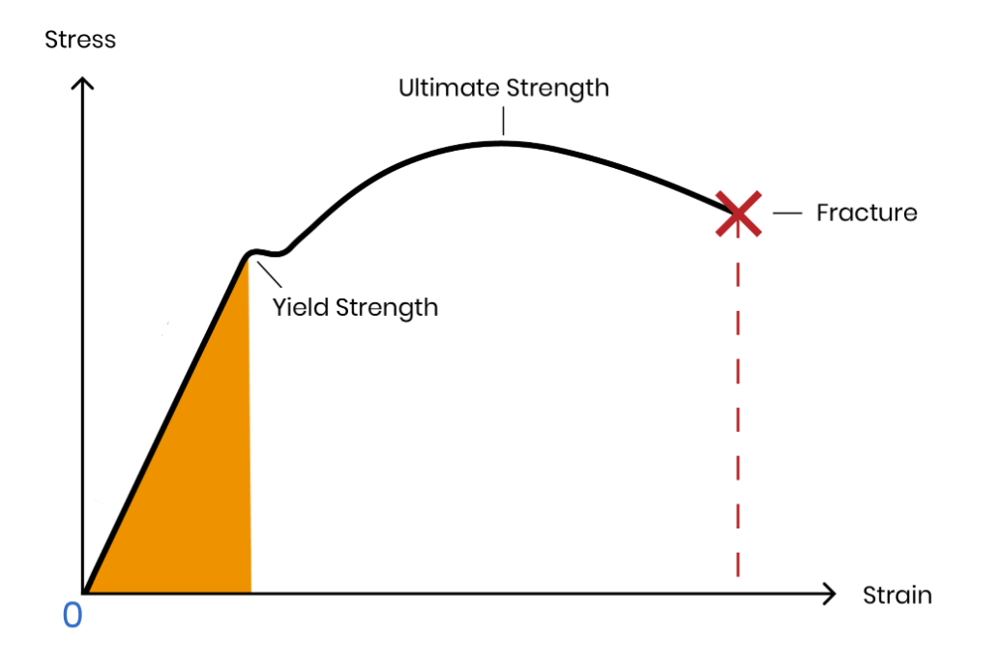
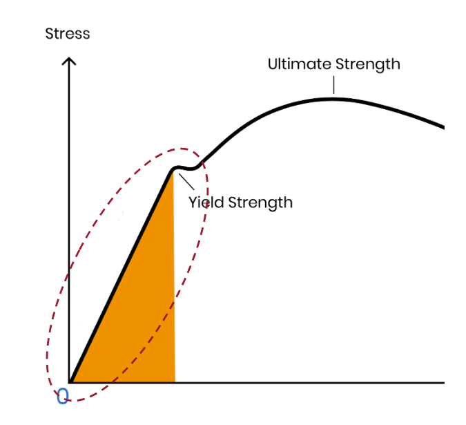

# Bab 3: Respon Material Terhadap Beban

## 1. Peta Perilaku Material: Diagram Tegangan-Regangan

Untuk memahami karakteristik respons material terhadap pembebanan, kita bisa mengacu pada **Diagram Tegangan-Regangan (Stress-Strain Diagram)**. 

Diagram ini menunjukkan hubungan antara Tegangan (Stress), yaitu besarnya beban per satuan luas, sedangkan sumbu horizontal merepresentasikan Regangan (Strain), yaitu besarnya deformasi atau perubahan panjang yang terjadi.

Kurva pada diagram ini menggambarkan perilaku mekanik material dari kondisi tanpa beban hingga terjadi kegagalan (kepatahan).

- **Titik Asal (0,0):** Kondisi awal tanpa beban
- **Area Elastis:** Area di mana tegangan berbanding lurus dengan regangan. Pada area ini, bentuk material dapat kembali ke bentuk semula.

- **Titik Luluh (Yield Strength Point):** Titik di mana bentuk material tidak lagi dapat kembali ke kondisi semula. Kondisi ini disebut juga sebagai deformasi plastis. Dalam mempertimbangkan kekuatan material, titik ini adalah nilai yang perlu diperhatikan.
- **Kekuatan Tarik Maksimum (Ultimate Tensile Strength - UTS):** Tegangan maksimum yang dapat ditahan
- **Titik Patah (Fracture Point):** Titik kegagalan material. Pada titik ini, material akan patah.

## 2. Konsep Dasar: Tegangan dan Regangan

Analisis mekanika material didasarkan pada dua parameter fundamental berikut:

### A. Tegangan (Stress) - Simbol: $\sigma$ (Sigma)

Tegangan didefinisikan sebagai besarnya gaya yang bekerja per satuan luas penampang. Konsep ini menjelaskan mengapa gaya yang kecil dapat menghasilkan dampak penetrasi yang besar jika luas penampangnya sangat kecil (seperti pada jarum suntik).

**Rumus Tegangan:**

$$\sigma = \frac{F}{A}$$

Dimana:
- $\sigma$ = Tegangan (Pa)
- $F$ = Gaya (Newton)
- $A$ = Luas Penampang (m²)

### B. Regangan (Strain) - Simbol: $\epsilon$ (Epsilon)

Regangan adalah perbandingan perubahan ukuran benda terhadap ukuran awalnya. Nilai ini merepresentasikan tingkat deformasi yang dialami oleh material akibat pembebanan.

**Rumus Regangan:**

$$\epsilon = \frac{\Delta L}{L_0} = \frac{L_{akhir} - L_{awal}}{L_{awal}}$$

Dimana:
- $\epsilon$ = Regangan (tanpa satuan)
- $\Delta L$ = Perubahan panjang (mm)
- $L_0$ = Panjang awal (mm)

## 3. Daerah Elastis Linear & Modulus Young

Daerah yang menjadi fokus utama dalam perancangan teknik adalah **Daerah Elastis Linear** (Linear Elastic Region). Pada daerah ini, kurva tegangan-regangan berbentuk garis lurus, yang mengindikasikan bahwa deformasi yang terjadi bersifat proporsional terhadap beban yang diberikan. Apabila beban dilepaskan pada fase ini, material akan kembali ke dimensi asalnya tanpa mengalami deformasi sisa.

Gradien atau kemiringan dari garis linear ini dikenal sebagai **Modulus Young (Modulus Elastisitas)** dengan simbol $E$. Nilai modulus Young dapat dihitung dengan formula berikut:

$$E = \frac{\sigma}{\epsilon}$$

Parameter ini merepresentasikan Kekakuan (Stiffness) material:

- **Nilai $E$ tinggi:** Material kaku, sulit mengalami deformasi (contoh: Baja)
- **Nilai $E$ rendah:** Material fleksibel (contoh: Aluminium, Polimer)

**Formula untuk menghitung deformasi ($\Delta L$):**

Jika kita telah mengetahui nilai modulus Young dari material, kita bisa memperkirakan perubahan ukuran (deformasi) yang dialami dengan formula berikut.

Maka, didapatkan rumus akhir:
$$
\Delta L = \frac{F \cdot L_0}{A \cdot E}
$$

> Nilai tersebut didapatkan dari urutan logika sebagai berikut.
> $$
> E = \frac{\sigma}{\epsilon}
> $$
> 
> Substitusi $\sigma = \frac{F}{A}$ dan $\epsilon = \frac{\Delta L}{L_0}$:
> 
> $$
> E = \frac{F/A}{\Delta L/L_0}
> $$
> 
> Sehingga:
> $$
> E = \frac{F \cdot L_0}{A \cdot \Delta L}
> $$
> 
> Maka, didapatkan rumus akhir:
> $$
> \Delta L = \frac{F \cdot L_0}{A \cdot E}
> $$

## 4. Contoh Perhitungan 

Berikut adalah aplikasi persamaan di atas dalam penyelesaian masalah teknik.

> **Catatan:** Satuan diseragamkan menjadi Newton (N) dan milimeter (mm) untuk memudahkan perhitungan, dimana 1 MPa = 1 N/mm².

### Kasus 1: Perhitungan Deformasi Elastis

**Soal:** Sebuah batang baja dengan panjang awal 1.000 mm dan luas penampang 200 mm² ditarik dengan gaya sebesar 20.000 N. Jika diketahui Modulus Elastisitas baja adalah 200.000 MPa, tentukan pertambahan panjang batang tersebut.

**Penyelesaian:**

Mulai dengan rumus umum:

$$
\Delta L = \frac{F \cdot L_0}{A \cdot E}
$$

Substitusi nilai ke dalam rumus:

$$
\Delta L = \frac{20.000 \times 1000}{200 \times 200.000}
$$

$$
= \frac{20.000.000}{40.000.000}
$$

$$
= 0,5 \ \text{mm}
$$

*Kesimpulan:* Batang baja mengalami pertambahan panjang sebesar **0,5 mm**.

### Kasus 2: Evaluasi Keamanan Struktur

**Soal:** Sebuah komponen baja sepanjang 0,5 m mengalami deformasi sebesar 0,25 mm akibat beban operasional. Diketahui Modulus Elastisitas baja 200 GPa dan Kekuatan Luluh (Yield Strength) 250 MPa. Evaluasilah apakah baja tersebut masih berada dalam batas aman elastisitas.

**Penyelesaian:**

1. Menghitung regangan ($\epsilon$) dengan rumus:
$$
\epsilon = \frac{\Delta L}{L_0}
$$
Dimana $\Delta L = 0,25$ mm dan $L_0 = 500$ mm, maka:
$$
\epsilon = \frac{0,25}{500} = 0,0005
$$

2. Menghitung tegangan ($\sigma$) menggunakan Hukum Hooke:
$$
\sigma = E \cdot \epsilon
$$
Dengan $E = 200.000$ MPa dan $\epsilon = 0,0005$, maka:
$$
\sigma = 200.000 \text{ MPa} \times 0,0005 = 100 \text{ MPa}
$$

**Kesimpulan:** Karena tegangan kerja (100 MPa) < Kekuatan Luluh (250 MPa), maka struktur dinyatakan **AMAN** dan masih berada dalam kondisi elastis.

## 5. Factor of Safety (Faktor Keamanan)

Dalam perancangan teknik, ketidakpastian beban, variabilitas material, dan faktor lingkungan mengharuskan penggunaan **Factor of Safety - FoS**. FoS didefinisikan sebagai rasio antara kekuatan material terhadap tegangan kerja aktual.

**Persamaan Factor of Safety ($n$):**

$$n = \frac{\sigma_{yield}}{\sigma_{working}}$$

**Kriteria desain:**
- **$n = 1$:** Struktur berada pada kondisi kritis (berbahaya)
- **$n > 1$:** Struktur berada dalam kondisi aman (nilai umum: 1,5 – 3,0)

### Studi Kasus Factor of Safety

**Soal:** Material baja memiliki Kekuatan Luluh 300 MPa. Spesifikasi desain mensyaratkan Faktor Keamanan minimum 2. Tentukan tegangan kerja maksimum yang diizinkan.

**Penyelesaian:**

$$
\sigma_{allowable} = \frac{\sigma_{yield}}{n}
$$
$$
\sigma_{allowable} = \frac{300 \text{ MPa}}{2} = 150 \text{ MPa}
$$

**Analisis:** Tegangan kerja tidak boleh melebihi 150 MPa. Apabila tegangan aktual mencapai 180 MPa, maka desain dinyatakan **TIDAK AMAN** karena tidak memenuhi kriteria faktor keamanan yang ditetapkan.

## 6. Latihan Soal

**Soal:** Sebuah batang baja, dengan panjang awal 1 m dan luas penampang 200 mm² ditarik dengan gaya sebesar 20.000 N. Berapa besar deformasi pada batang baja tersebut? (Modulus Young baja adalah 200.000 MPa)

**Penyelesaian:**

Formula utama:
$$
\Delta L = \frac{F \cdot L_0}{E \cdot A}
$$

Informasi dari soal:
- $F = 20.000~\text{N}$
- $L_0 = 1~\text{m} = 1.000~\text{mm}$
- $E = 200.000~\text{MPa}$
- $A = 200~\text{mm}^2$

Substitusi ke dalam formula:
$$
\Delta L = \frac{20.000 \times 1.000}{200.000 \times 200}
$$

Perhitungan:
$$
\Delta L = \frac{20.000.000}{40.000.000} = 0{,}5~\text{mm}
$$

**Jawaban:** Deformasi pada batang baja tersebut adalah **0,5 mm**.

----

**Soal:** Sebuah batang baja dengan panjang 0,5 m mengalami deformasi sebesar 0,25 mm. Jika modulus elastisitas Young baja adalah 200 GPa, apakah baja tersebut masih dalam kondisi aman? (Yield strength baja 250 MPa)

**Penyelesaian:**

Langkah 1: Konversi satuan dan tuliskan data yang diberikan:
- $L_0 = 0,5~\text{m} = 500~\text{mm}$
- $\Delta L = 0,25~\text{mm}$
- $E = 200~\text{GPa} = 200.000~\text{MPa}$
- $\sigma_\text{yield} = 250~\text{MPa}$

Langkah 2: Hitung regangan ($\epsilon$):
$$
\epsilon = \frac{\Delta L}{L_0} = \frac{0,25}{500} = 0,0005
$$

Langkah 3: Hitung tegangan yang bekerja ($\sigma$) menggunakan hukum Hooke:
$$
\sigma = E \cdot \epsilon = 200.000 \times 0,0005 = 100~\text{MPa}
$$

Langkah 4: Bandingkan dengan kekuatan luluh (yield strength).

- Tegangan kerja ($100~\text{MPa}$) < Kekuatan luluh ($250~\text{MPa}$)

**Kesimpulan:** Baja tersebut **masih dalam kondisi aman** karena tegangan kerjanya masih di bawah nilai kekuatan luluh material.

----

**Soal:** Sebuah baja memiliki nilai Yield Strength $300~\text{MPa}$. Jika desain yang dibuat memiliki factor of safety $2$, maka:
1. Berapa tegangan maksimum yang diperbolehkan?
2. Jika tegangan yang diterima 180 MPa, apakah desain tersebut tetap aman?

**Penyelesaian:**

Langkah 1: Data yang diketahui:
- Yield Strength ($\sigma_\text{yield}$): $300~\text{MPa}$
- Factor of Safety ($n$): $2$
- Tegangan kerja (\textit{actual}): $180~\text{MPa}$

Langkah 2: Hitung tegangan maksimum yang diperbolehkan ($\sigma_\text{izin}$) menggunakan rumus factor of safety:

$$
\sigma_\text{izin} = \frac{\sigma_\text{yield}}{n} = \frac{300}{2} = 150~\text{MPa}
$$

Langkah 3: Bandingkan dengan tegangan yang diterima:

- Tegangan yang diterima: $180~\text{MPa}$
- Tegangan yang diperbolehkan: $150~\text{MPa}$

Karena $180~\text{MPa} > 150~\text{MPa}$, maka tegangan yang terjadi melebihi tegangan izin.

**Kesimpulan:**
1. Tegangan maksimum yang diperbolehkan adalah **150 MPa**.
2. Jika tegangan yang diterima sebesar **180 MPa**, maka **desain tersebut tidak aman** (karena melebihi batas aman yang dihitung dengan factor of safety).