# Bab 4: Degradasi Material

Setelah kita berhasil memilih material yang kuat dan menghitung bebannya dengan presisi, tugas seorang engineer belumlah selesai. Masih ada masalah besar yang dapat muncul. Seiring berjalannya waktu, material akan mengalami penurunan kualitas atau degradasi. 

Di bab ini, kita akan membahas empat degradasi utama pada material: **Korosi, Fatigue, Wear, dan Thermal**.

## 1. Korosi (Corrosion)

Korosi adalah proses degradasi material, terutama logam, akibat reaksi elektrokimia dengan lingkungannya. 

Semua jenis logam pasti mengalami korosi. Baik itu baja, alumunium, perak, dan lain sebagainya, semuanya mengalami korosi dalam bentuknya masing-masing. Ada logam yang mudah mengalami korosi, namun adapula yang lebih sulit mengalami korosi. Ole karena itu, penting bagi kita untuk memahami sifat korosi ini.

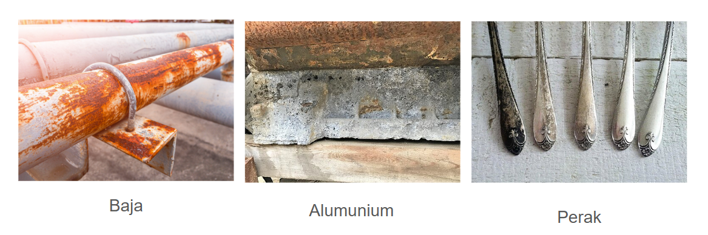

### Faktor Pemicu Korosi

Korosi dipicu oleh beberapa sebab berikut:

- **Kelembapan (Air):** Bertindak sebagai elektrolit yang memfasilitasi aliran ion.
- **Oksigen:** Bertindak sebagai oksidator utama.
- **Zat Asam & Garam:** Mempercepat reaksi secara agresif. Ion klorida pada garam laut sangat merusak lapisan pelindung logam (kendaraan di pantai lebih cepat berkarat).
- **Celah & Goresan:** Titik lemah di mana air bisa terperangkap dan memulai karat.

### Strategi Pencegahan

Mengingat korosi pasti terjadi, maka cara yang bisa dilakukan adalah berupa pencegahan, agar proses korosi terjadi dalam waktu yang lebih lama. Berikut adalah beberapa strategi utamanya:

- **Coating (Pelapisan):** Metode paling umum (cat, chrome, galvanis) untuk memisahkan logam dari udara/air.
- **Desain Struktur:** Memastikan tidak ada cekungan yang menampung air.
- **Pemilihan Material:** Menggunakan bahan tahan korosi seperti Stainless Steel.
- **Sacrificial Anode:** Menempelkan logam "tumbal" (seperti Seng, Magnesium, dll) yang lebih reaktif agar logam utama tetap aman dan semua karat terbentuk pada logam tumbal. 

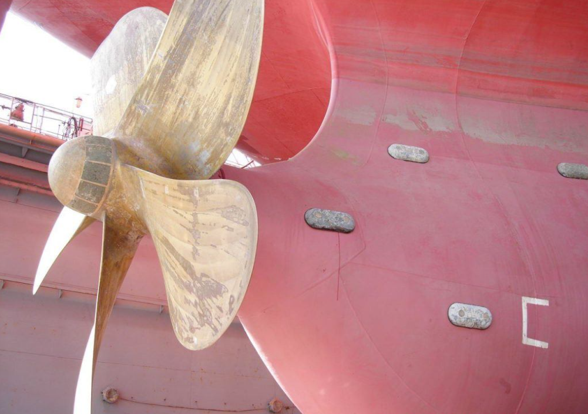
_Lambung kapal diberi tambahan logam Magnesium sebagai sacrificial anode. Magnesium akan berkarat lebih dahulu, sehingga lambung kapal tidak berkarat_

_Stainless steel adalah bahan campuran antara besi, karbon, dan chromium, yang dapat membentuk lapisan pelindung di bagian luar logam. Oleh karena itu, bahan stainless steel membutuhkan waktu yang lebih lama untuk berkarat_

### Studi Kasus: Tragedi Gas Bhopal (1984)

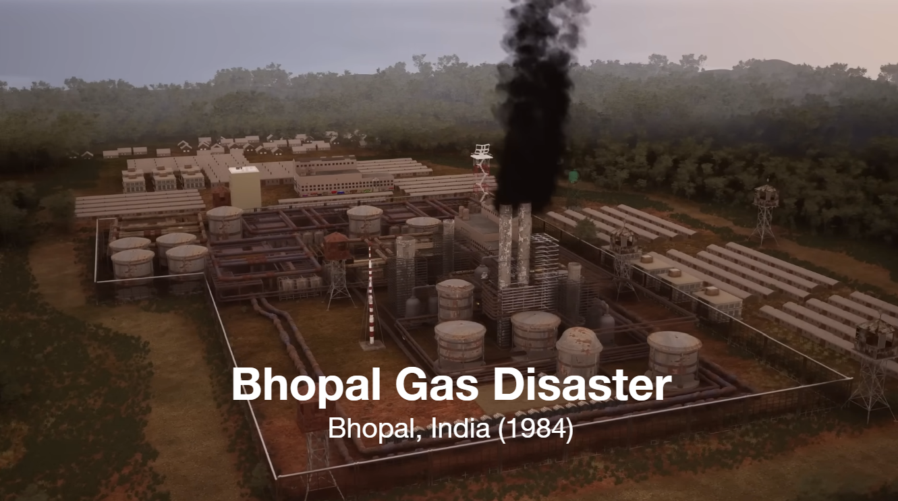

Bahaya korosi yang terlihat sepele ini pernah memicu kecelakaan besar pada tahun 1984 di Bhopal, India. Kejadian ini disebut sebagai Bhopal Disaster. Akibat kejadian ini, 3000 orang meninggal dunia dan lebih dari 500.000 orang terdampak.

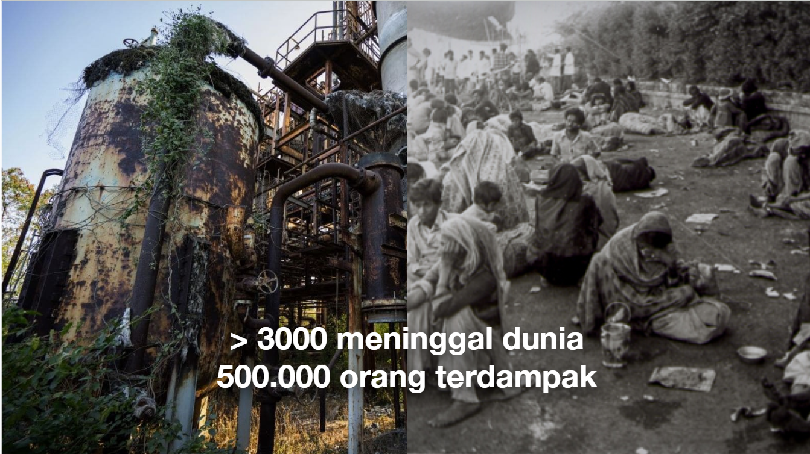

Bagian utama yang menyebabkan banyaknya korban adalah bocornya gas beracun MIC (Metil isosianat) dari pabrik pestisida. Adapun investigasi teknis mengungkapkan bahwa bencana ini bermula dari masuknya air ke dalam tangki penyimpanan gas, yang memicu reaksi kimia panas dan ledakan. 

Bagaimana air bisa masuk? Ternyata, air merembes melalui sebuah _valve_ (katup penyekat) yang bocor karena korosi. Kegagalan komponen kecil yang berkarat ini memungkinkan air pencuci pipa berbalik arah (backflow) dan masuk ke tangki fatal tersebut dan memicu pelepasan gas MIC dalam jumlah besar.

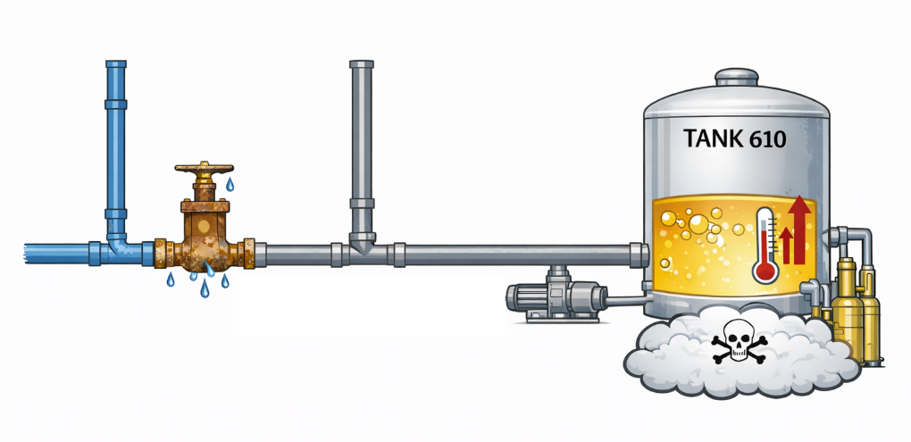

## 2. Fatigue (Kelelahan Material)

Pernahkah kamu memutuskan kawat logam dengan cara menekuknya bolak-balik berulang kali? Kawat tersebut putus bukan karena kamu tarikanmu yang kuat, melainkan karena ia mengalami kelelahan atau **Fatigue**. Fatigue adalah kerusakan material yang disebabkan oleh pembebanan yang berulang-ulang (cyclic loading) dalam jangka waktu lama.

Aspek paling mengerikan dari fatigue adalah ia bisa mematahkan material meskipun beban yang diterima jauh di bawah batas kekuatan luluhnya (Yield Strength). Struktur yang secara perhitungan aman, bisa tiba-tiba runtuh jika terkena beban berulang jutaan kali. 

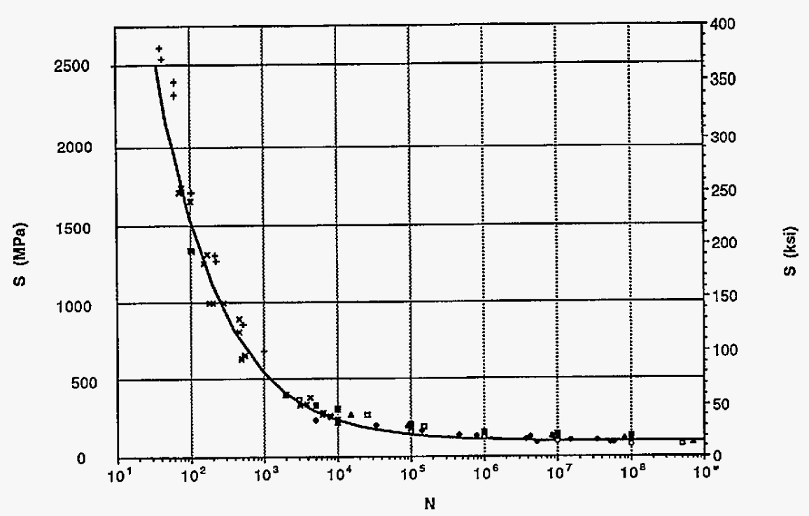

Untuk memperkirakan kekuatan suatu bahan terhadap pembebanan berulang sebelum fatigue, kita bisa menggunakan kurva **S-N (Stress vs Number of Cycles)**. Kurva ini menunjukkan berapa banyak pengulangan yang dibutuhkan pada nilai stress tertentu sebelum material mengalami fatiguw.

### Studi Kasus: Aloha Airlines Flight 243 (1988)

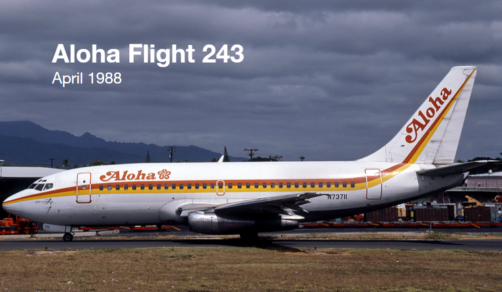
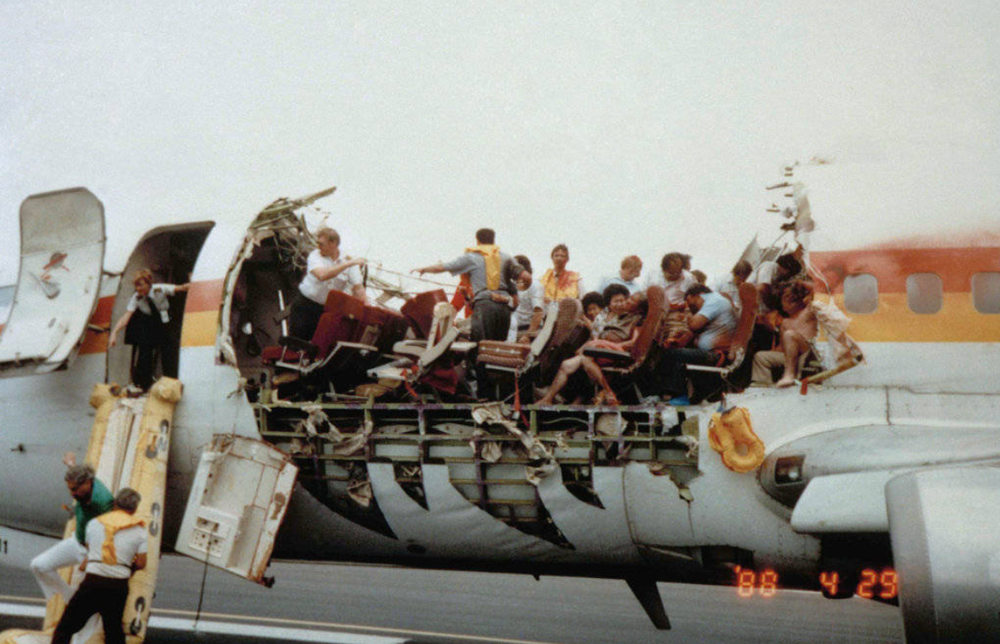

Contoh klasik kegagalan fatigue terjadi pada penerbangan Aloha Airlines 243. Saat terbang di ketinggian 24.000 kaki, atap bagian depan pesawat tiba-tiba robek dan terlepas. Penyebab utamanya adalah siklus tekanan udara (pressurization cycle) di mana setiap kali pesawat take-off, kabin dipompa (mengembang), dan saat landing, tekanan dibuang (mengempis). 

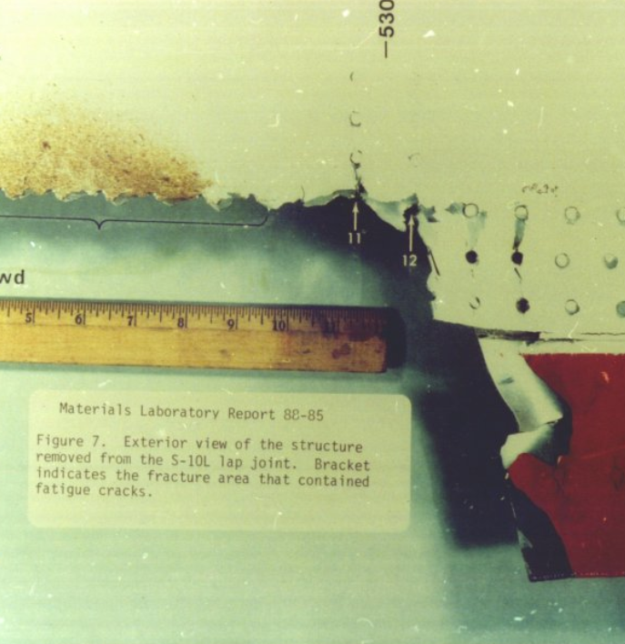

Pesawat tua ini telah mengalami puluhan ribu siklus "kembang-kempis" tersebut. Beban berulang ini, diperparah oleh korosi, menyebabkan sambungan paku keling (rivet) mengalami kelelahan dan merobek badan pesawat.

## 3. Wear (Keausan)

Selain korosi dan fatiguw, material juga mengalami penuaan fisik yang disebut **Wear** atau keausan. Ini adalah hilangnya material dari permukaan benda padat akibat gesekan atau kontak mekanis langsung dengan benda lain. Meskipun wajar, keausan pada komponen vital bisa sangat berbahaya.

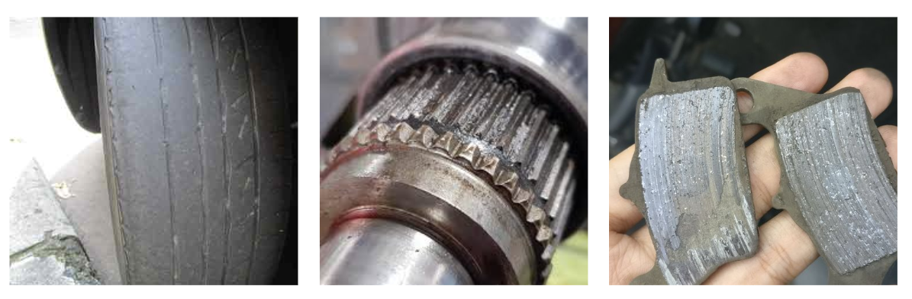

**Contoh keausan dalam kehidupan sehari-hari:**

- **Ban kendaraan:** Menjadi botak (halus) karena gesekan dengan aspal.
- **Kampas rem:** Menipis seiring penggunaan.
- **Gir & Rantai:** Gigi gir menjadi tajam/runcing karena gesekan logam-ke-logam.

### Studi Kasus: Alaska Airlines Flight 261 (2000)

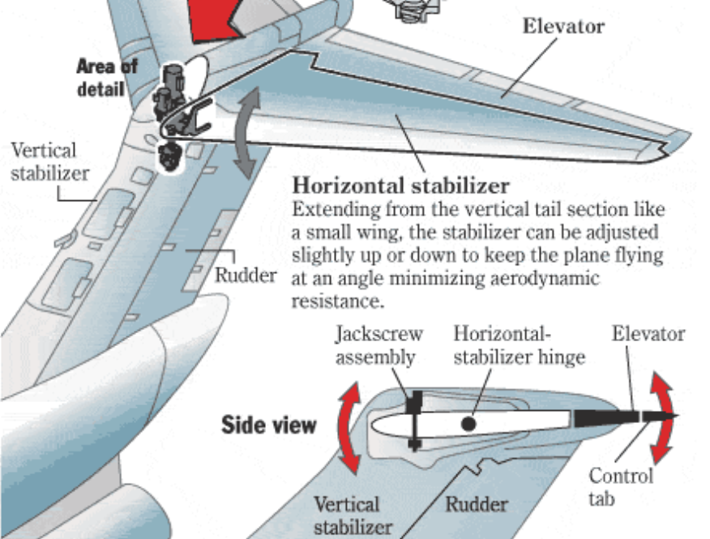

Tragedi jatuhnya pesawat MD-83 di lepas pantai California menjadi peringatan keras tentang bahaya keausan. Pesawat jatuh karena pilot kehilangan kendali atas ekor pesawat. Investigasi menemukan bahwa komponen penggerak ekor, yaitu Jackscrew Assembly (mirip baut raksasa), telah mengalami keausan total.

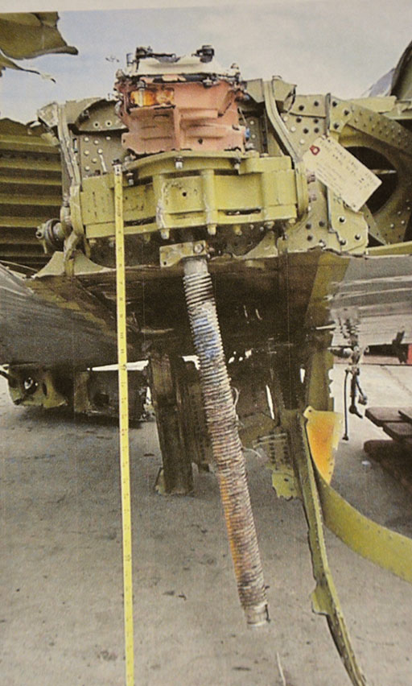

Ulir (thread) pada mur jackscrew tersebut gundul (stripped) akibat gesekan logam-ke-logam yang ekstrem karena kurangnya pelumasan (grease).

## 4. Degradasi Thermal (Suhu)

Faktor terakhir yang sering merusak material adalah suhu ekstrem. Material umumnya didesain untuk bekerja optimal pada suhu ruang, dan sifat mekaniknya bisa berubah total jika suhu berubah drastis:

- **Suhu Tinggi (Panas):** Material logam akan mengalami penurunan kekuatan (menjadi lunak).

- **Suhu Rendah (Dingin):** Material menghadapi risiko menjadi getas (brittle). Seperti pada kasus Titanic, suhu beku mengubah logam yang tadinya ulet menjadi rapuh seperti kaca, sehingga mudah pecah saat terkena benturan.

Oleh karena itu, pada setiap produk, sangat penting untuk memberikan informasi rentang suhu aman yang bisa ditolerir oleh benda tersebut.